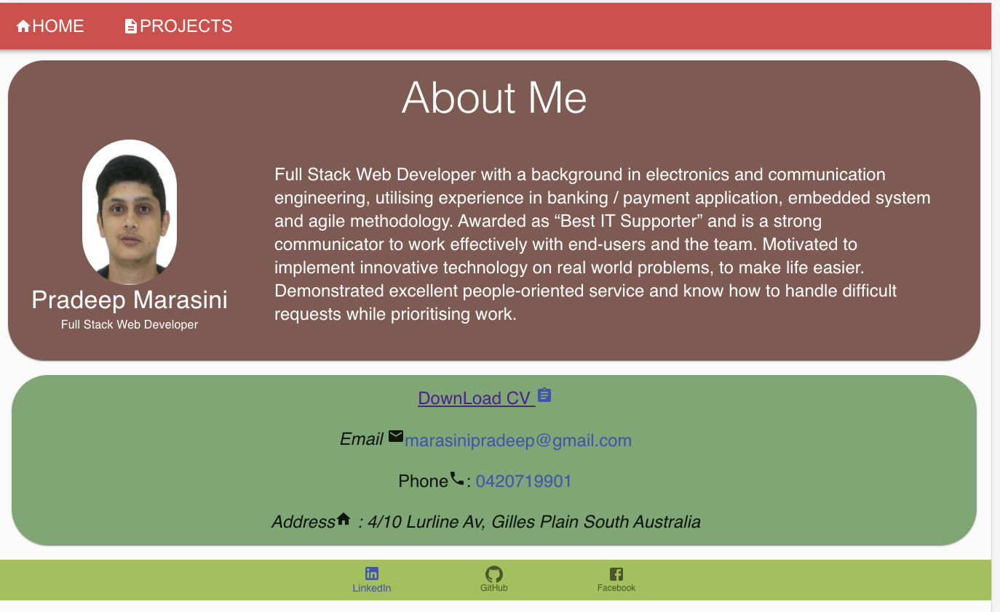
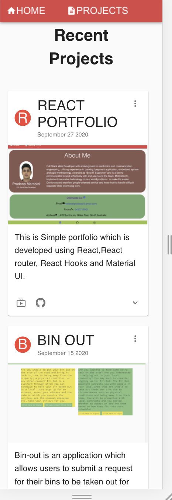

# Pradeep Marasini React Portfolio

## Description

* The portfolio is build using React and hooks.
* Portfolio is featuring 6 total projects

It consist of:-

* A `Header` component that appears on multiple pages

* A single `Project` component that will be used multiple times on a single page 

* Navigation with React Router, dynamic rendering, or another third part router

* A `Footer` component that appears on multiple pages

## Instructions

* [Updated Portfolio](#updated-portfolio)

* [Design](#design)

* [React](#react)

* [Updated LinkedIn Profile](#updated-linkedin-profile)

### Updated Portfolio

The sit  have :

* name

* Links to  GitHub profile & LinkedIn page as well as  email address and phone number

* A link to a PDF of resume with projects

* A list of projects. For each project,  have the following:

  * Project title

  * Link to the deployed version

  * Link to the GitHub repository

  * GIF or screenshot of the deployed application

#### Design

The site is "polished."

* Mobile-first design

### React

This portfolio is created using React.

Portfolio includes the following:

* A `Header` component that appears on multiple pages

* A single `Project` component that will be used multiple times on a single page 

* Navigation with React Router, dynamic rendering, or another third part router

* A `Footer` component that appears on multiple pages

### Updated LinkedIn Profile 

